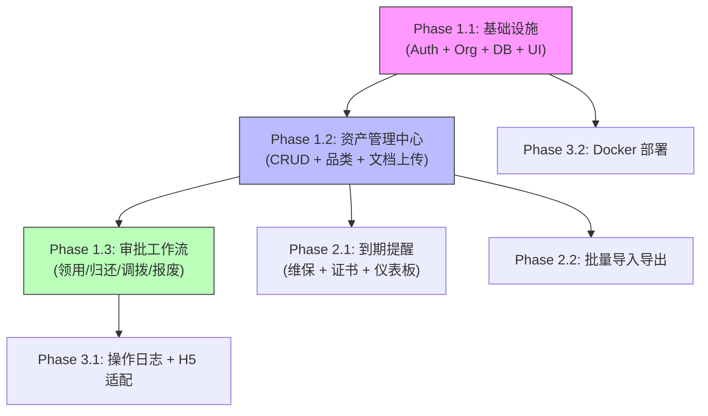

# 项目开发路线图 (Development Roadmap)

## 0. 策略概览

*   **开发策略**: 先搭地基（认证 + 组织 + UI 组件库），再建核心（资产 CRUD），接着补流程（审批流），最后加提醒和批量操作。每个 Phase 完成后系统具备独立的可用价值。
*   **MVP 目标**: 用户能登录 → 看到本分支的资产列表 → 录入新设备 → 发起领用申请 → 部门负责人审批 → IT 管理员确认执行，形成领用闭环。

---

## 1. 里程碑一：MVP (核心闭环)

> 目标：实现"入库 → 领用申请 → 审批 → 执行"完整链路，能用起来。

### Phase 1.1: 基础设施 (Infrastructure)

- [x] **任务**: 项目脚手架 + 数据库 + 认证 + 组织 + 共享组件
    *   **模块**: `lib/db/`、`lib/auth/`、`modules/org/`、`shared/`
    *   **内容**:
        1. 项目初始化（`pnpm create next-app` + TypeScript + Tailwind + ESLint/Prettier）
        2. Prisma Schema 设计与初始迁移（User、Branch、Department 表）
        3. 认证系统（登录/登出/JWT 会话/角色识别）
        4. 组织架构 CRUD（分支 → 部门 → 用户三级）
        5. 管理后台布局（侧边栏 + 顶部导航 + shadcn/ui 集成）
        6. 权限中间件（API 路由保护 / 角色校验）
    *   **依赖**: 无
    *   **完成后**: 用户可登录，能看到空的管理后台框架，管理员可创建分支和用户

### Phase 1.2: 资产管理中心 (核心)

- [x] **任务**: 资产 CRUD + 品类枚举 + 状态管理
    *   **模块**: `modules/assets/`、`app/(dashboard)/assets/`
    *   **内容**:
        1. Asset 表设计（包含八大品类、设备状态字段）
        2. 资产列表页（分页表格 + 状态筛选 + 品类筛选 + 关键词搜索）
        3. 资产详情页（基本信息 + 归属记录 + 设备状态时间线）
        4. 新增资产页（入库表单，支持八大品类按需切换字段）
        5. 资产状态管理（闲置 ↔ 使用中 ↔ 维保 ↔ 已报废，状态流转校验）
        6. 安全文档上传功能（文件上传 + 有效期设置 + 附件管理）
    *   **依赖**: Phase 1.1
    *   **完成后**: 可录入、查询、编辑、查看设备，资产数据成为系统核心数据源

### Phase 1.3: 审批工作流

- [ ] **任务**: 领用 → 归还 → 调拨 → 报废 完整审批链路
    *   **模块**: `modules/approvals/`、`app/(dashboard)/approvals/`
    *   **内容**:
        1. Approval 表设计（审批类型、状态、审批链）
        2. 员工端：发起领用申请（选择闲置设备 → 填写事由 → 提交）
        3. 员工端：我的申请列表（状态跟踪）
        4. 负责人端：待审批列表 + 审批详情页（通过/驳回 + 驳回理由）
        5. IT 管理员端：待执行列表 + 确认执行（更新资产状态 + 归属人）
        6. 归还 / 调拨 / 报废审批（复用同一审批流引擎，调整状态变更逻辑）
    *   **依赖**: Phase 1.2
    *   **完成后**: 完整的领用闭环可跑通，MVP 达成 🎉

---

## 2. 里程碑二：功能完善 (Feature Complete)

> 目标：补充到期提醒、批量操作、数据仪表板，系统日常可用。

### Phase 2.1: 到期提醒

- [ ] **任务**: 维保到期提醒 + 安全文档到期提醒 + 首页仪表板
    *   **模块**: `modules/reminders/`、`lib/cron/`、`app/(dashboard)/page.tsx`
    *   **内容**:
        1. 首页仪表板（即将到期设备列表、即将到期文档列表、我的待审批）
        2. 定时任务 `node-cron`（每日扫描即将到期的设备和文档）
        3. 到期预警标记（维保 ≤ 30 天黄色预警，≤ 7 天红色预警）
        4. 安全文档有效期管理（等保、渗透测试报告等的到期自动提醒）
    *   **依赖**: Phase 1.2
    *   **完成后**: 管理员登录首页即可看到哪些设备和证书即将到期

### Phase 2.2: 批量导入与数据导出

- [ ] **任务**: CSV 批量导入 + 资产数据导出
    *   **模块**: `app/(dashboard)/assets/import/`
    *   **内容**:
        1. CSV 模板下载 + 格式说明
        2. 文件上传 → 字段映射 → 数据校验 → 逐行导入
        3. 导入错误报告（错误行号 + 具体原因）
        4. 资产列表导出 Excel（按当前筛选条件导出）
    *   **依赖**: Phase 1.2
    *   **完成后**: 初期可批量导入存量设备数据

---

## 3. 里程碑三：增强与上线 (Enhancement & Launch)

> 目标：操作可追溯、体验优化、生产就绪。

### Phase 3.1: 操作日志与安全加固

- [ ] **任务**: 操作审计日志 + 移动端 H5 适配优化
    *   **模块**: `lib/`（全局日志中间件）
    *   **内容**:
        1. 核心操作日志记录（谁在什么时间做了什么操作，操作前后数据变化）
        2. 移动端 H5 适配优化（审批页、资产查询页的触摸交互和布局）
        3. 登录安全加固（错误次数限制、密码强度校验）
        4. 敏感操作二次确认（删除资产、报废确认）
    *   **依赖**: Phase 1.3
    *   **完成后**: 每次关键操作都有据可查

### Phase 3.2: Docker 部署与生产就绪

- [ ] **任务**: 多架构 Docker 镜像 + Nginx 配置 + 部署文档
    *   **内容**:
        1. Dockerfile 多阶段构建（builder + runner）
        2. `docker buildx` 多架构镜像构建脚本（amd64 + arm64）
        3. Nginx 反向代理配置模板
        4. systemd 服务单元模板
        5. 部署文档（麒麟/欧拉环境部署步骤）
    *   **依赖**: Phase 1.1
    *   **完成后**: 可一键部署到麒麟或欧拉服务器上

---

## 依赖关系图

---

**使用指南**:

1. **功能开发**: 按照 Phase 编号顺序依次开发，每完成一个 Phase 使用 `feature-implementation` Skill 进入下一阶段。
2. **进度追踪**: 每完成一个任务，回到本文档勾选 `[x]`。
3. **分支管理**: 每个 Phase 对应一个功能分支（如 `feat/phase-1.2-assets`），完成后 Squash Merge 到 `main`。
